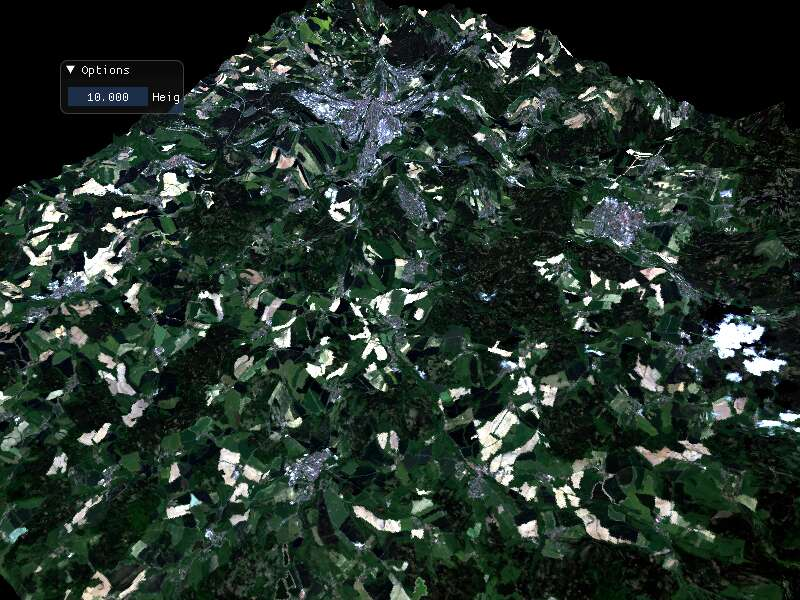
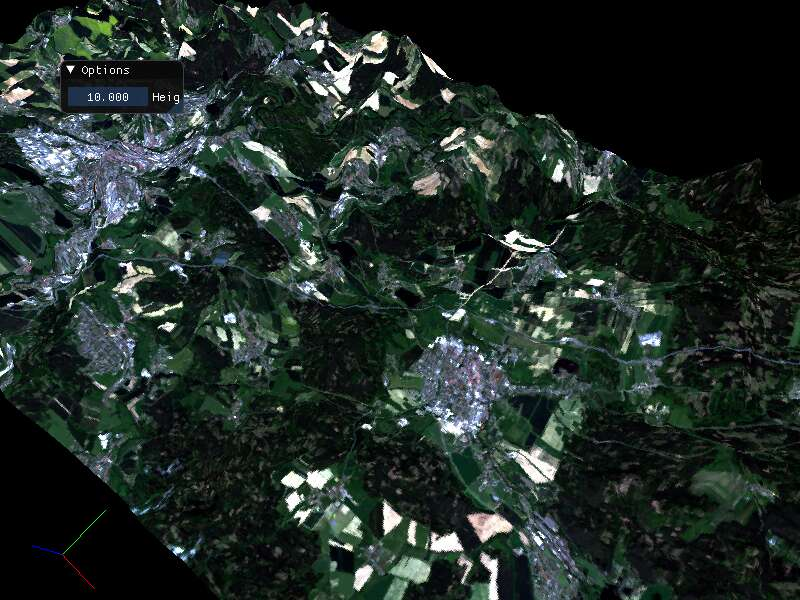
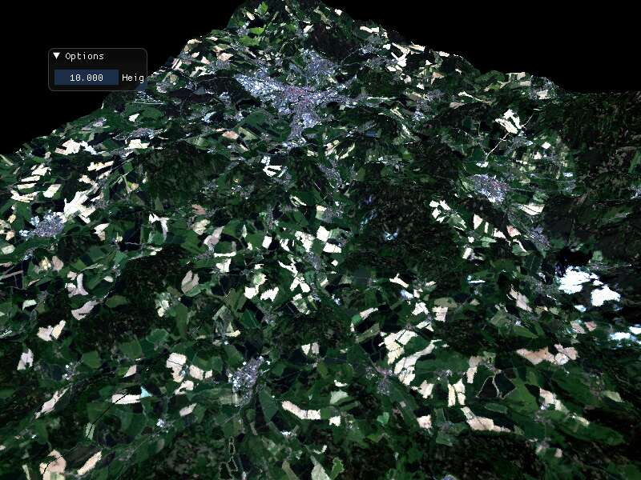
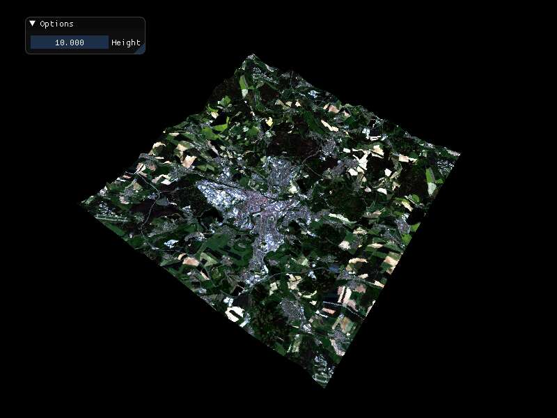
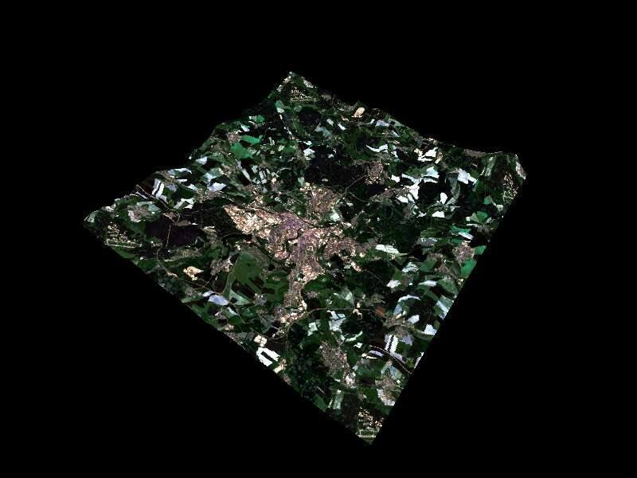
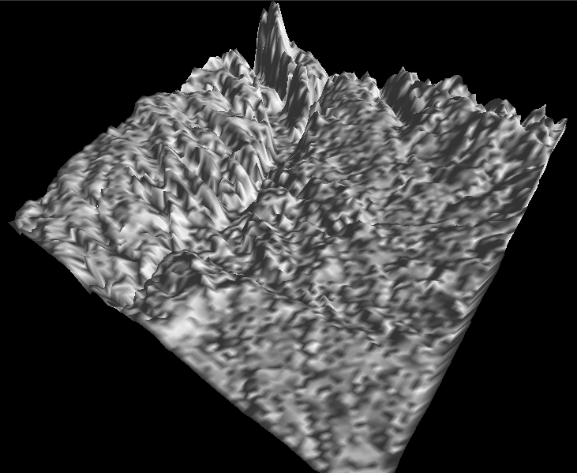
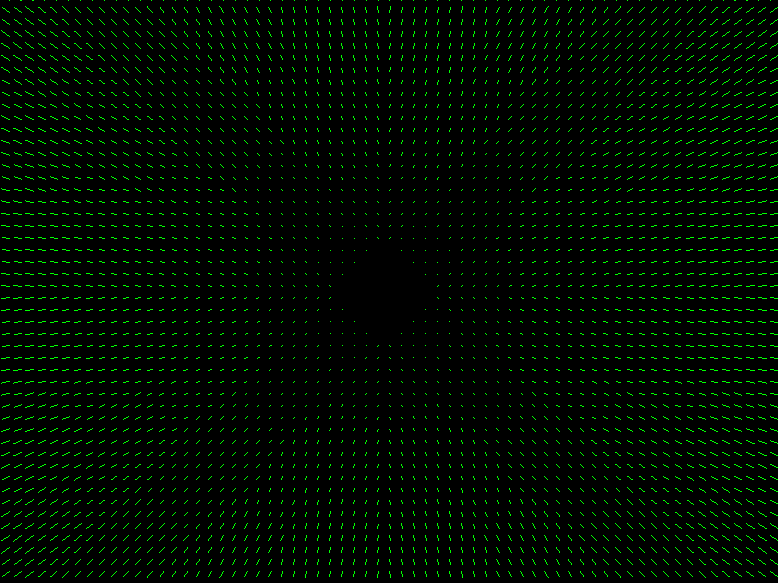
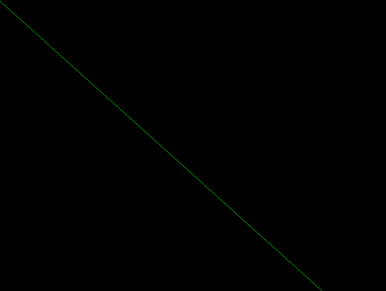

# About
Bunch of earth rendering samples to create a program capable to render earth surface based on satellite data.

# How to build
> **note**: We expect *Ubuntu 22.04 LTS* as operating system.

```bash
sudo apt install libmagick++-dev libtiff-dev libglm-dev libsdl2-dev libspdlog-dev libfmt-dev libboost-dev
```
> **tip**: up-to-date list of dependencies can be seen in `SConstruct` file as `deps` variable

command and build with
```bash
scons -j8
```
command. We can optionally build specific sample with
```
scons -j8 SAMPLE-NAME
```
command (e.g. `scons -j8 height_sinxy`).

# Datasets
Samples needs data to get them working and we have bunch of python/bash scripts to generate that data.

To create an environment with all dependencies run
```bash
cd script
./setup_conda_env
```
## Manual setup
- create *earthren* python environment to get scripts working with
```bash
cd script
conda env create -f environment.yml
```
commands.
> we expect *conda* is installed see [[Python tips#3-2) Inštalácia?]]

- (optional) check *earthren* environment created with
```console
$ conda env list                                                
# conda environments:                                                            
#                                                                                
base                  *  /home/ja/miniconda3                                     
earthren                 /home/ja/miniconda3/envs/earthren
```

## Data management
Our samples can require huge amount data to work (e.g. elevation, satellite tiles) and we do not want push new data for each sample. We want to reuse data, therefore we
- use LFS to manage binary data
- we use scripts to generate data for specific sample (see `script/*_data` files)

E.g. to prepare Plzen area data (used by `terrain_mesh`, `height_overlap` or `four_terrain` samples) we have `prepare_plzen` script which would create `plzen_elev.tif` and `plzen_rgb.tif` into `data` directory. Then e.g. `height_overlap_data` script which use Plzen area data and generates tiles for `height_overlap` sample in `data/gen` directory.

# Samples

## `terrain_mesh`
Renders 4 terrains next to each other without tile edges issue (elevation and satellite) as in a previous `four_terrain` sample.



This sample use the same data as `height_overlap` sample so to generate data
- go to `script` directory
- run `prepare_plzen` to generate Plzen area tiles and then
- run `height_overlap_data` to generate sample tiles into `data/gen/four_terrain`

## `height_overlap`
The sample shows how to get rid of elevation tile edge height issue from `four_terrain` sample.



To generate data for the sample
- go to `script` directory
- run `prepare_plzen` to generate Plzen area tiles and then
- run `height_overlap_data` to generate sample tiles into `data/gen/four_terrain`

## `four_terrain`
Renders 4 terrains next to each other. Sample based on `height_scale` sample


Figure: `four_terrain` sample screenshot.

What is new:
- `axes_model`, `flat_shader` introduced
- `set_uniform` introduced

## `height_scale`
Shows how to integrate GUI to play with height scale values during terrain rendering.  Based on `satellite_map` example.


Figure: `height_scale` sample screenshot.

What is new:
- GUI used

## `satellite_map`

Sample shows how to apply satellite imagery (Landsat 8 mission) to a terrain (see `terrain_quad` sample).

We have managed to flip satellite texture (we still needs to flip elevation map). The resulting render doesn't realistic due to height scale constant set to 10.0, see  Figure: Current `satellite_map` sample result.

What is new:
- satellite imagery as a terrain texture
- elevation and satellite textures are flipped

## `terrain_quad`
...

## `height_map`
`Height_map` sample shows how to render terrain based on height map texture (*TIFF* file). 


The sample is based on previous [[#`height_sinxy_normals`]] sample code. There is just one quad in scene and also XY axis are not scaled and Z (heights) is scaled by a factor of $100$.

See previous [[#`height_sinxy_normals`]] sample to get an idea how artificial terrain (heights generated by a function) can be rendered. In this sample instead of computed data we are using real world height map (from a Prague area for now).

For other reference, see [[OpenGL ES 3.0 Programming Guide#Rendering Terrain with Vertex Texture Fetch]] sample where normals are calculated directly in a vertex shader program.

What is new:
- TIFF file support (libtiff)
- spdlog logging library used
- direction light visualization (press `l` key)
- normals visualization (press `n`)
- outline visuali<ation (press `o`)
- usage of general geometry shaders `to_line.gs`, `to_outline.gs`
- free-camera implementation

## `geoms_plane`
Visualization of normals for a plane. We found a workaround for `gs_triangle_broken` issue so there are not any visible artifacts anymore.


What is new:
- unified `to_line_v0.gs` shader program
- unified `to_normal.gs` shader program

We later found that this workaround is not always working (outline visualization still produce artifacts when the camera is close enough).

## `gs_triangle_broken`

The sample show geometry shader program artifacts for a simple quad with a camera, see

**Figure**: Artifacts while rendering normals in geometry shader program.

This issue affects all samples using geometry shader (normals, height_map, ...).

## `normals`

`Normals` sample shown how to visualize computed normals. It is based on `height_sinxy_normals` sample.


What is new:
- geometry shader used
- two shader program used
- render features used (e.g. normals)
- events features used (`zoom_in` event)

## `height_sinxy_normals`

`Height_sinxy_normals` shows how to read heights and calculate normals out of 16bit height map in a vertex shader program. The sample is based on previous [[#`height_sinxy_map`]] sample. 


What is new:
- 16bit height map used
- shows how to use indices (IBO) for a mesh creation.
- use depth buffer (`GL_DEPTH_TEST`)
- use `GL_CULL_FACE` testing

## `height_sinxy_normals_fce`

This sample is a modification of [[#`height_sinxy_normals`]] where normals are not calculated from height map, but by exact function.  See [[#`height_sinxy_map`]] sample for $sinxy$ function description.


## `height_sinxy_map`

`Height_sinxy_map` sample is similar to `plot_sinxy` sample, but instead of calculating $z$ value in a vertex shader we want to have a height map (generated in CPU part of the program by $z=\sin(x) \cdot \sin(y)$ for $x,y \in [0, \pi]$ equation).


## `plot_sinxy`

This sample is similar to previous [[#`plot_sinxy`]] but instead of directional light, fragment color is set based on computed height.


## `height_sinxy`

`Height_sinxy` sample shows how to calculate terrain heights (z coordinate) for xy-axis quad. Heights are generated by $z=\sin(x) \cdot \sin(y)$ for $x,y \in [0, \pi]$ equation in a vertex shader program. Together with heights we calculate also normals for a directional light computing in a fragment shader program.


## `map_camera`

`Map_camera` sample shows orbital camera implementation allows to rotate around z-axis and x-axis with a mouse move. Sample is based on previous `xy_plane_grid_textured` sample.


## `xy_plane_grid_textured`

`Xy_plane_grid_textured.cpp` shows grid of xy_planes the same as previous `xy_plane_grid.cpp` sample but with a texture applied.

The problem there is that pane is not smooth it has a kind of momentum. Affected samples are `xy_plane_grid.cpp`, `xy_plane_grid` and `xy_plane_panzoom` samples.

Another issue is that it is hard to diagnose issues in a shader program, see issue 1.

ToDo:
- rewrite pan functionality
- use VAOs (see `map_camera` as an example)


Then next step is to implement a camera which would allow smooth pane and zoom. I would like to implement *Proland* like camera.

Then next step is to add heights, I need to figure out area for sample tiles (see `data/tiles`), download heights for that area and spit it to tiles. Then modify shader to add texture (ortho) based heights (in this step without any noise or upsampling).

## `xy_plane_grid`

Shows grid of xy_planes with a zoom and pane features. There is not any camera implementation there.

The problem there is that pane is not smooth it has a kind of momentum. Affected samples are `xy_plane_grid` and `xy_plane_panzoom` samples.

ToDo:
- rewrite pan functionality

Next step is to implement a grid of xy_planes rendered with a image inside (instead fixed color). To see how to render a image see `texture_storage` sample and how to render to a xy plane see `xy_plane_texture` sample.

Then Next step is to implement a camera which would allow smooth pane and zoom.

## `xy_plane_texture`

Shows how to render xy plane fillet with an image

Problems: 
	- we should use VAOs


## `texture_storage`

Shows how to render a picture to screen.

Issues:
- VAOs are used incorrect way in a sample, see `map_camera` sample to learn how to use it

## `xy_plane_panzoom`

xy plane with zoom and pane capabilities


## `xy_plane`

Just a simple red xy plane rendered.


# Code Formatting

Formatting source code is done by `.clang-format` configuration file. To see LLVM style defaults run 

```bash
clang-format -style=llvm -dump-config > .clang-format
```

command.
